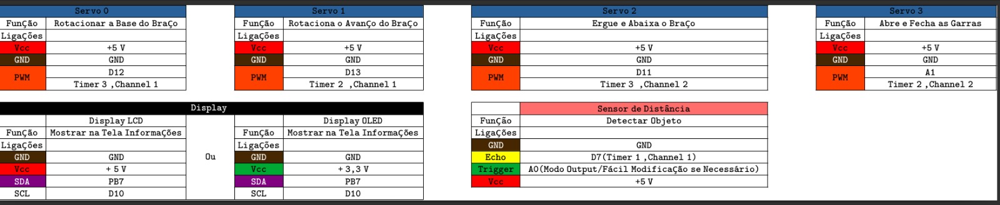

# ProjetoFinal_BracoRobotico
Braço Robótico em Linha de Produção

# Princípio de Funcionamento  
(Descreva brevemente o objetivo principal do dispositivo ou sistema, explicando como ele opera em termos gerais.)

---

# Conexões  
### **Conexões dos Servos**  
**Servo 0:**  
- **Função:** Rotacionar a base do braço.  
- **Ligações:**  
  - Vcc: +5 V  
  - GND: GND  
  - PWM: D12 (Timer 3, Channel 1)  

**Servo 1:**  
- **Função:** Rotacionar o avanço do braço.  
- **Ligações:**  
  - Vcc: +5 V  
  - GND: GND  
  - PWM: D13 (Timer 2, Channel 1)  

**Servo 2:**  
- **Função:** Erguer e abaixar o braço.  
- **Ligações:**  
  - Vcc: +5 V  
  - GND: GND  
  - PWM: D11 (Timer 3, Channel 2)  

**Servo 3:**  
- **Função:** Abrir e fechar as garras.  
- **Ligações:**  
  - Vcc: +5 V  
  - GND: GND  
  - PWM: A1 (Timer 2, Channel 2)  

### **Conexões do Display**  
**Display LCD:**  
- **Função:** Mostrar informações na tela.  
- **Ligações:**  
  - GND: GND  
  - Vcc: +5 V  
  - SDA: PB7  
  - SCL: D10  

### **Conexões do Sensor de Distância**  
- **Função:** Detectar objeto.  
- **Ligações:**  
  - GND: GND  
  - Vcc: +5 V  
  - Echo: D7 (Timer 1, Channel 1)  
  - Trigger: A0 (Modo Output, fácil modificação se necessário)  

Segue abaixo as Configurações

# Como  Funciona?  

O princípio de funcionamento do braço robótico é semelhante ao de uma linha de distribuição. Um sensor de distância detecta a presença de um objeto a uma determinada distância, que pode ser configurada. A partir desse evento, o braço robótico é acionado, movimentando o produto para o local previamente definido.

## Sensor de Distância (Ultrassônico)  

O sensor ultrassônico é um dispositivo que utiliza ondas sonoras de alta frequência, inaudíveis para o ouvido humano, para medir distâncias. Seu funcionamento baseia-se no princípio de emissão e recepção de ondas sonoras:  

1. **Emissão do Sinal**: O sensor emite um pulso ultrassônico na direção do objeto.  
2. **Reflexão do Sinal**: Quando o pulso atinge o objeto, ele é refletido de volta em forma de eco.  
3. **Recepção do Sinal**: O sensor detecta o eco refletido.  
4. **Cálculo da Distância**: A distância do objeto é determinada medindo o tempo que o pulso leva para ir e voltar, utilizando a fórmula:  

   $$ \text{Distância} = \frac{\text{Velocidade do Som} \times \text{Tempo}}{2}$$ 

A divisão por 2 ocorre porque o tempo medido inclui o trajeto de ida e volta do sinal.  

Para esse propósito, foi utilizada uma interrupção para detectar o evento da borda de subida do pino *Echo*, iniciando a contagem de tempo. A contagem prossegue até a detecção da borda de descida do mesmo pino. Com o tempo medido e a velocidade do som conhecida, é possível calcular a distância do objeto.

# Testes e Depuração 
(Adicione este tópico se for útil descrever como testar o sistema e solucionar possíveis problemas.)  

- **Testes Básicos:** Verifique os sinais e conexões.  
- **Mensagens de Erro:** Identifique e solucione problemas comuns.  

# Futuras Melhorias *(Opcional)*  

- Leitor RFID
- Sensor de Cor
- Ajuste de Velocidade
