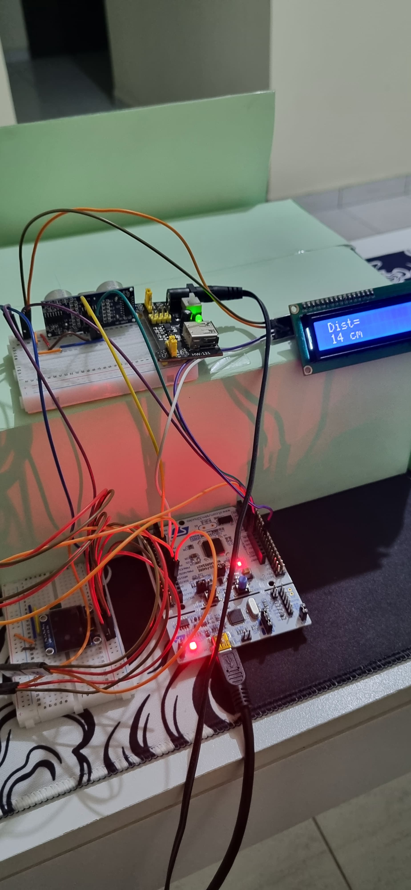

# ProjetoFinal_BracoRobotico
Braço Robótico em Linha de Produção

# Dispositivos Utilizados  

- *Placa Nucleo STM32F446RE*  
  Utilizada como o microcontrolador principal para controlar o sistema e processar os dados.  

- *Sensor de Distância Ultrassônico HC-SR04*  
  Responsável por medir a distância de objetos para detectar sua posição.  

- *Fonte de Alimentação Ajustável*  
  Fornece energia necessária para alimentar todos os componentes do sistema.  

- *Protoboards de 400 Pontos (x2)*  
  Usados para conectar os componentes eletrônicos de forma prática e organizada durante a montagem.  

- *Servomotores (x4)*  
  Utilizados para realizar os movimentos do braço robótico.  

- *Braço Robótico*  
  Estrutura mecânica responsável por manipular e mover os objetos detectados pelo sistema.

---

# Conexões  
### **Conexões dos Servos**  
**Servo 0:**  
- **Função:** Rotacionar a base do braço.  
- **Ligações:**  
  - Vcc: +5 V  
  - GND: GND  
  - PWM: D12 (Timer 3, Channel 1)  

**Servo 1:**  
- **Função:** Rotacionar o avanço do braço.  
- **Ligações:**  
  - Vcc: +5 V  
  - GND: GND  
  - PWM: D13 (Timer 2, Channel 1)  

**Servo 2:**  
- **Função:** Erguer e abaixar o braço.  
- **Ligações:**  
  - Vcc: +5 V  
  - GND: GND  
  - PWM: D11 (Timer 3, Channel 2)  

**Servo 3:**  
- **Função:** Abrir e fechar as garras.  
- **Ligações:**  
  - Vcc: +5 V  
  - GND: GND  
  - PWM: A1 (Timer 2, Channel 2)  

### **Conexões do Display**  
**Display LCD:**  
- **Função:** Mostrar informações na tela.  
- **Ligações:**  
  - GND: GND  
  - Vcc: +5 V  
  - SDA: PB7  
  - SCL: D10  

### **Conexões do Sensor de Distância**  
- **Função:** Detectar objeto.  
- **Ligações:**  
  - GND: GND  
  - Vcc: +5 V  
  - Echo: D7 (Timer 1, Channel 1)  
  - Trigger: A0 (Modo Output, fácil modificação se necessário)  

Segue abaixo as Configurações

## **Montagem**

# Como  Funciona?  

O princípio de funcionamento do braço robótico é semelhante ao de uma linha de distribuição. Um sensor de distância detecta a presença de um objeto a uma determinada distância, que pode ser configurada. A partir desse evento, o braço robótico é acionado, movimentando o produto para o local previamente definido.

## Sensor de Distância (Ultrassônico)  

O sensor ultrassônico é um dispositivo que utiliza ondas sonoras de alta frequência, inaudíveis para o ouvido humano, para medir distâncias. Seu funcionamento baseia-se no princípio de emissão e recepção de ondas sonoras:  

1. *Emissão do Sinal*: O sensor emite um pulso ultrassônico na direção do objeto.  
2. *Reflexão do Sinal*: Quando o pulso atinge o objeto, ele é refletido de volta em forma de eco.  
3. *Recepção do Sinal*: O sensor detecta o eco refletido.  
4. *Cálculo da Distância*: A distância do objeto é determinada medindo o tempo que o pulso leva para ir e voltar, utilizando a fórmula:  

   $$ \text{Distância} = \frac{\text{Velocidade do Som} \times \text{Tempo}}{2}$$ 

A divisão por 2 ocorre porque o tempo medido inclui o trajeto de ida e volta do sinal.  

Para esse propósito, foi utilizada uma interrupção para detectar o evento da borda de subida do pino Echo, iniciando a contagem de tempo. A contagem prossegue até a detecção da borda de descida do mesmo pino. Com o tempo medido e a velocidade do som conhecida, é possível calcular a distância do objeto.

Para isso foi utilizado o seguinte Código, disponível em: [Codigo Sensor Distancia](https://controllerstech.com/hcsr04-ultrasonic-sensor-and-stm32/)

Se a distância do objeto for menor que o valor configurado no parâmetro de distância, o evento é acionado e a ação do braço robótico é disparada.

## Display LCD

No projeto, o display LCD foi configurado para exibir informações recebidas continuamente do microcontrolador, que coleta dados do sensor de distância. Este sensor, utilizado para detectar a presença de objetos na linha de produção, fornece a distância do item detectado. Quando um objeto é identificado pelo sensor, a mensagem "Objeto Encontrado" é exibida no LCD e permanece visível até que a operação da garra seja concluída. Após a finalização da operação, o sistema aguarda a detecção de um novo objeto, atualizando a tela conforme necessário.

Para a intregração do I2C com o display LCD foi utilizado commo base o seguinte código, disponível em: [Bibloteca Para o LCD com I2C](https://controllerstech.com/i2c-lcd-in-stm32/)

# Testes e Depuração 
## **Vídeo Demonstrativo**  

https://github.com/user-attachments/assets/ed80046e-e39a-4f70-a09a-9c54a8750d74

# Futuras Melhorias *(Opcional)*  

A implementação de novas funcionalidades pode expandir as capacidades e a eficiência do sistema. Algumas sugestões incluem:  

- **Leitor RFID**:  
  Incorporar um leitor RFID permite a identificação precisa de objetos por meio de etiquetas eletrônicas. Essa melhoria é ideal para sistemas que precisam diferenciar produtos ou rastrear itens específicos em tempo real.  

- **Ajuste de Velocidade**:
  Implementar a capacidade de ajustar a velocidade do braço robótico ou da esteira de transporte permite maior flexibilidade e otimização do desempenho. Isso possibilita adequar o sistema a diferentes tipos de objetos ou cenários de operação, melhorando a eficiência e a precisão.

- **Sensor de Temperatura**:
  Adicionar o sensor de temperatura para identificação de incêndios afim de interromper as atividades da linha de produção

- **Buzzer**:
  Emitir avisos sonores de operação do braço robótico, como também alerta de incêndio

- **Motor DC**:
  Inserir um motor para controle de uma esteira, de modo a levar os objetos de forma autônoma até o local de identificação das mercadorias 
  
  
